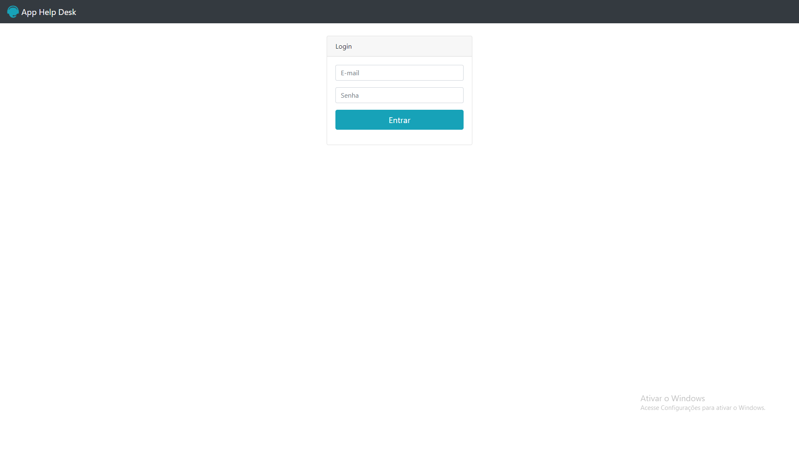
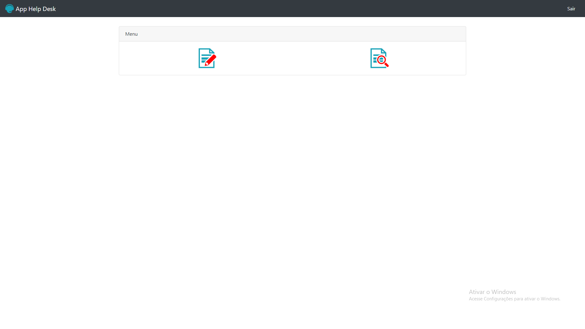
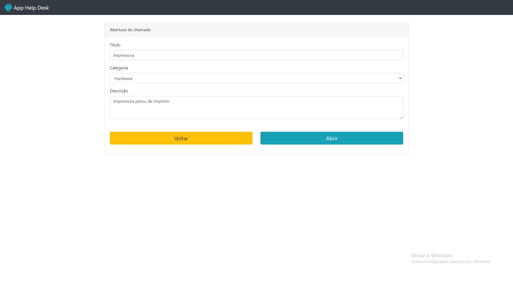
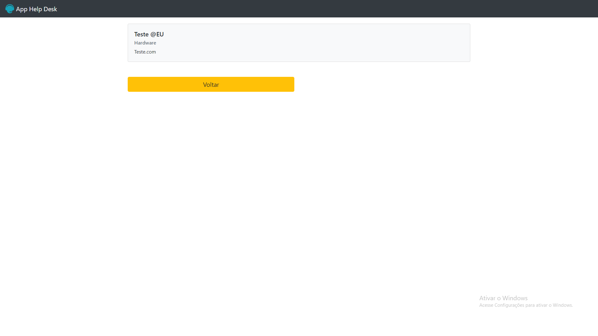

# Help-desk

 

 

 <h1> 📝 Descrição do projet </h1>
 
 
  software projetado para gerenciar e automatizar o suporte e atendimento ao cliente ou usuários de um produto, serviço ou sistema. Ele oferece uma plataforma centralizada para receber, resolver e monitorar solicitações de suporte, perguntas, problemas técnicos, consultas e outros tipos de interações relacionadas ao suporte.
       

 ## Funcionalidades

:heavy_check_mark: Registro de Solicitações: Os usuários podem enviar suas solicitações de suporte por meio do sistema.

:heavy_check_mark: Triagem: As solicitações são organizadas em uma fila de suporte.

:heavy_check_mark: Controle: Somente usuários registrados como "Administrador" podem ter o acesso a todos os chamados registrados. Usuários sem esse registro só poderão ver seus própios chamados.

## 🚀 Tecnologias

Esse projeto está sendo desenvolvido com as seguintes tecnologias:

- PHP

  

